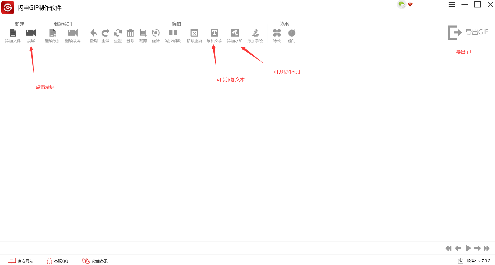
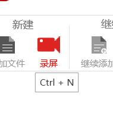
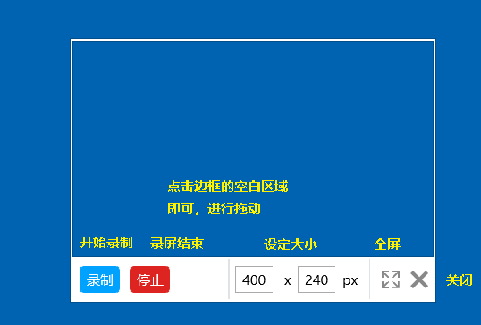
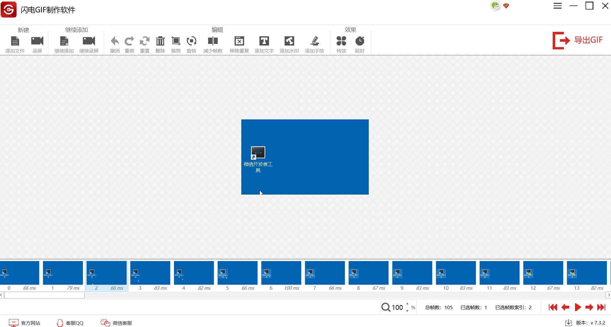
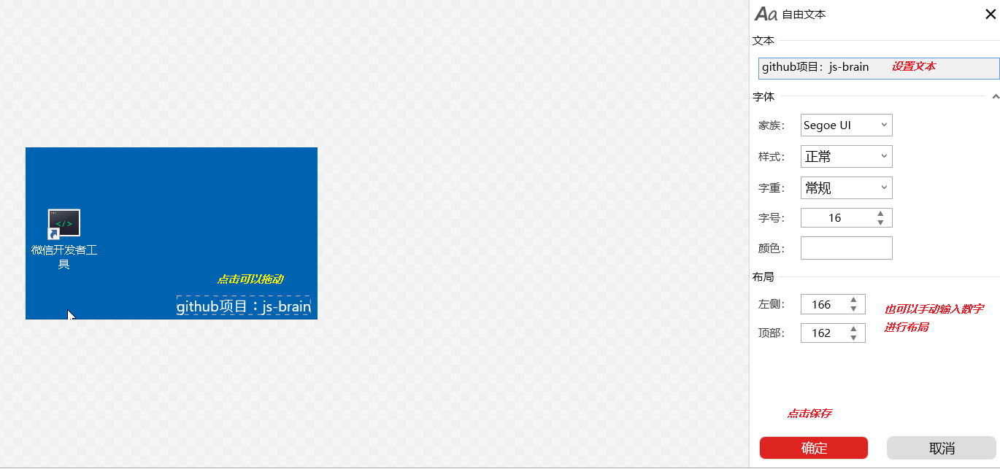
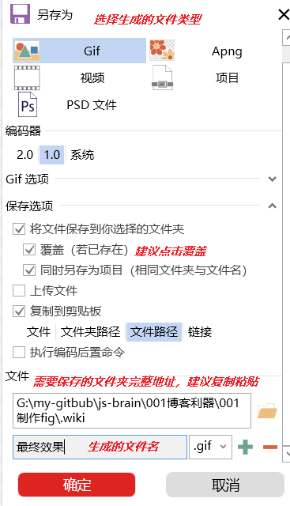

# 制作gif

#### 一、下载一款gif制作软件

这里使用的是：闪电gif制作工作

+ http://jxpro.miaoying1.cn/gif/

 

#### 二、熟悉操作界面

+ 进入录屏
+ 加入水印
+ 导出生成

#### 三、具体操作

+ 1 打开录屏窗口

+ 2 调整录屏窗口的大小与位置

+ 3 查看关键帧

+ 4 添加文字/水印

选中需要添加文字的关键帧，然后进行操作

+ 4 导出gif

#### 四、最终效果

