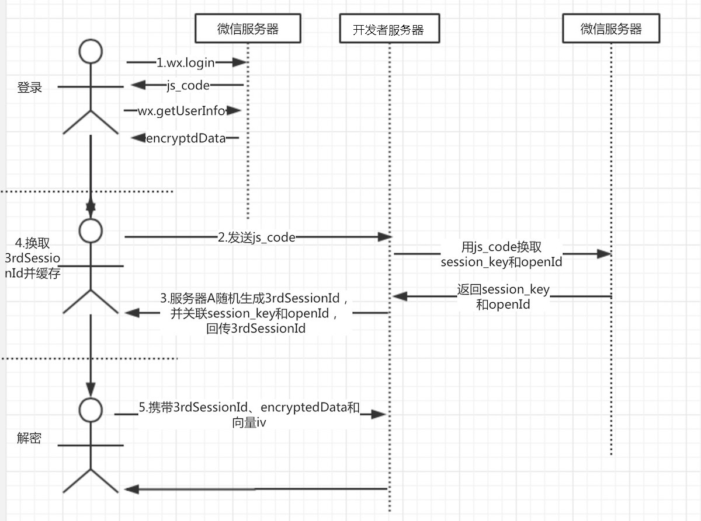

# 用户数据加密解密过程

#### 基本过程

 | 过程| 说明|
| :------ | :-------------------------------- |
| 加密| 微信服务器完成加密|
| 解密| 微信服务器 通过小程序客户端获取中间数据，转发 开发者服务器 完成加密 |


#### encryptData 数据结构

```js
{
    "openId": "OPENID",
    "nickName": "NICKNAME",
    "gender": "GENDER",// int
    "city": "CITY",
    "province": "PROVINCE",
    "country": "COUNTRY",
    "avatarUrl": "AVATARURL",
    "unionId": "UNIONID",
    "watermark": {
        "appid": "APPID",
        "timestamp": TIMESTAMP,// number
    }
}
```

#### 过程与算法




+ Base64 编解码
+ AES算法、填充模式、偏移向量
+ session_key 会话密钥、存储和获取


#### 具体过程

+ 1 小程序客户端 调用 `wx.login`，回调里面包含`js_code`

+ 2 `js_code` 发送到 开发者服务器 , 开发者服务器 向 微信服务器发起请求 附带 `js_code、appId、secretkey和grant_type` 参数

+ 3 开发者服务器 接收到 微信服务器 关于用户的 `openid` 和` session_key`（会话密钥）

+ 4 开发者服务器 生成一个随机数 `token` , 以 token 为 key,以 `session_key + openid` 为value 缓存到 redis 或 memcached中

+ 5 小程序客户端 得到 `token` 后缓存到 `storage`


+ 6 小程序客户端 通过 `wx.getUserIinfo`可以获取到用户敏感数据 `encryptedData` 和 `偏移量`

+ 7 小程序客户端 将 `encryptedData、 移量偏iv  和 token`一起发送到 开发者服务器

+ 8 开发者服务器 根据 `3rdSessionId` 从缓存中获取`session_key` 使用 `AES解密` encryptedData，从而实现敏感数据解密