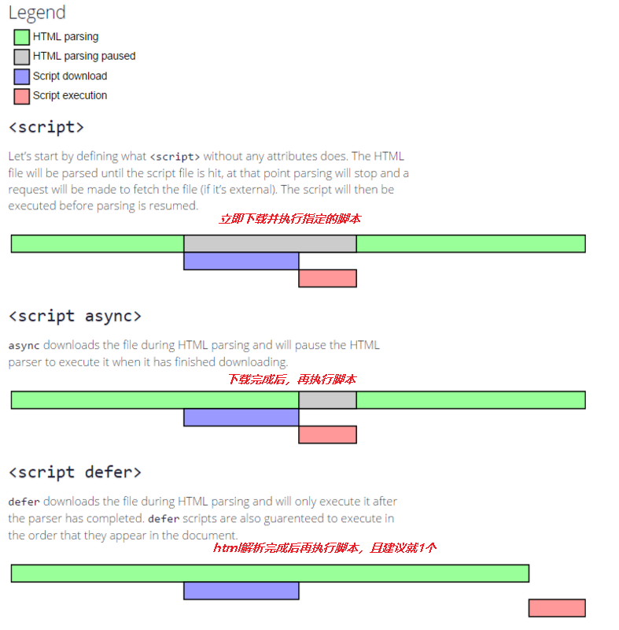

# 无阻塞加载文件

#### 跨域

+ DOM Element
```js
var scriptElem=document.createElement('script');
scriptElem,src='http://test.js';
document.getElementByTagName('head')[0].appendChild(scriptElem);
```

+ document.write script标签

```html
<script>document.write("<script>alert('foo')<\/script>")</script>
```


+ eval

把一些脚本拆分，然后通过ajax的方式请求脚本，再通过eval来执行
```js
 eval("js text");
```

+ XHR注入  动态加载

```js
document.getElementsByTagName('head')[0].appendChild(scriptElem);
scriptElem.text=xhrObj.responseText;
```


+ defer/async 属性 
   + 无    ，  立即下载并执行指定的脚本
   + async ，  脚本下载完成后立即执行
   + defer ，  脚本下载与html解析同时进行，且在DOM解析完后再执行，建议只包含一个延迟脚本
   
```html
<script defer src='test.js'></script>
```




#### 同域

+ iframe
为iframe认为其返回的是HTML文档。所有我们要做的就是在HTML文档中把外部脚本转换为行内脚本。并且要求iframe和主页面同域
```
1.通过frames数组：window.frames[0]
2.通过document.getElementById访问。
```

