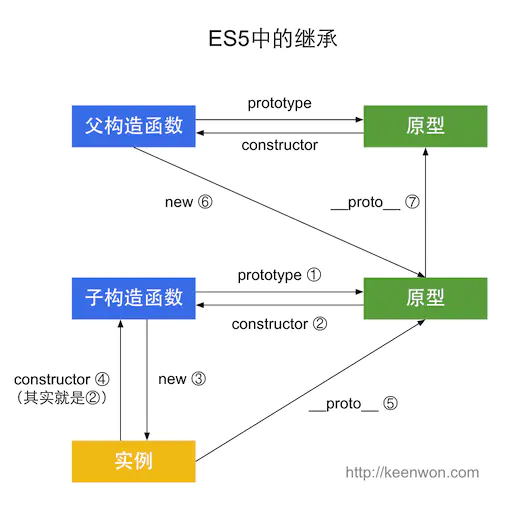
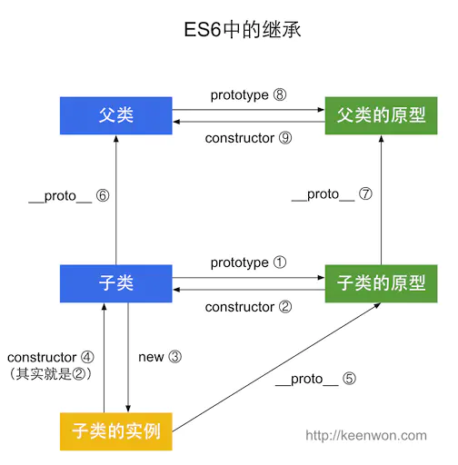

# js继承


 > 每一个对象都有__proto__属性，指向对应的构造函数的prototype属性


####  ES5 


> 通过 prototype 或 构造函数 机制来实现，寄生组合式,1个继承链



```js
function Fater(a,b){
    this a = a;
    this b = b;
}
function Son(c){
    this c = c
};

Fater.call(Son,1,2)
```

+ 1 先创建子类元素child的的实例对象
+ 2 再把父类元素parent的原型对象中的属性赋值给子类元素child的实例对象里面

```js

// SonInstance.__proto__ = Fater.prototype

```


#### ES6

> 寄生继承, 2个继承链， 使用 extends   constructor  super 关键字 ， extends的过程中创建了一个自执行函数 , `子类的构造函数必须执行一次父函数`，在原来继承的基础上，支持静态方法继承



+ 在babel解析后, 除了子类的原型继承以外，还多了子类的自身继承父类


```js
class father {
    constructor(name) {
        this.name = name;
    }
    fatherFn() {
        console.log(this.name);
    }
}

class son extends father {
    constructor(name, age) {
        super(name);
        // super代表父类的构造函数，相当于父类.prototype.constructor.call(this)  
        // 所以必须先调用父类的super()方法，才可使用this关键字，否则报错。），
        this.age = age;
    }
    sonFn() {
        console.log(this.age);
    }
}
```

+ 1  用父类构造函数的proptype创建一个空对象
+ 2  将这个对象指向子类构造函数的proptype
+ 3  将父构造函数指向子构造函数的__proto__


```js
//  1 FatherInstance = new Father()
//  2 SonInstance.prototype =  FatherInstance
//   

 
```


