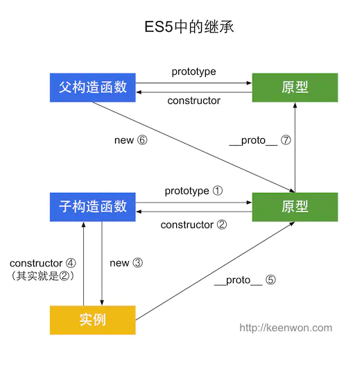
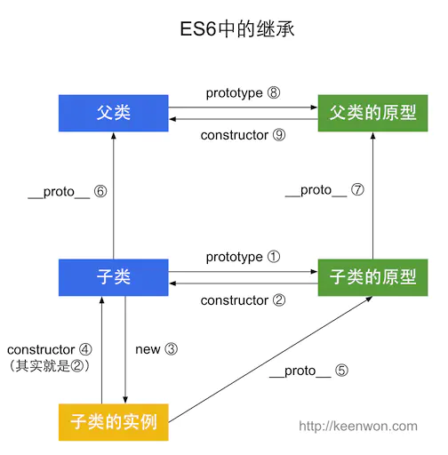

# js继承

> 本质上是 子类的原型的构造函数 等于 父类

####  ES5 (寄生组合式,1个继承链) 

> 通过 prototype 或 构造函数 机制来实现

+ 实质上是先创建子类的实例对象，然后再将父类的方法添加到 this 上(father.apply(this))

+ 1 son.prototype.constructor == father

#### ES6 (2个继承链) 使用 extends 和 constructor 关键字

> 子类的构造函数必须执行一次父函数

+ 在babel解析后, 除了子类的原型继承以外，还多了子类的自身继承父类

+ 1 sonInstance.__proto__ === father

+ 2 sonInstance.prototype.__proto__ === father.prototype
