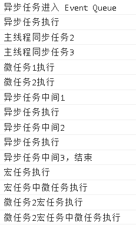

# 宏任务、微任务、异步任务

+ 同步任务
    + 页面骨架和页面元素的渲染过程
    + 执行栈的非宏任务微任务

+ 异步任务
    + 加载图片等资源
    + async...await

+ 宏任务队列 task queue , 含 callback
   + script
   + settimeout
   + setinternal 
   + setimmediate 
   + requestAnimationFrame ， 60Hz ， 1000ms / 60 
   + IO UI render
   + new promise()

+ 微任务队列 micro task queue
   + process.nextTick(node)
   + promise.resolve().then() 
   + object.observe
   + mutationObserver

#### 浏览器事件循环与执行情况

#### 事件循环

+ 标识符绑定
+ 创建 活动对象
+ 生成作用域链 (活动对象，上一个作用域的活动对象)

+ 主线程执行
+ 异步任务的`第1个await，然后挂起`
+ 主线程执行
+ 执行并清空微任务队列 micro task queue
+ 回到Event Table 清空 异步任务
+ 开始执行宏任务，连带执行里面全部的微任务

#### 可视化结果

