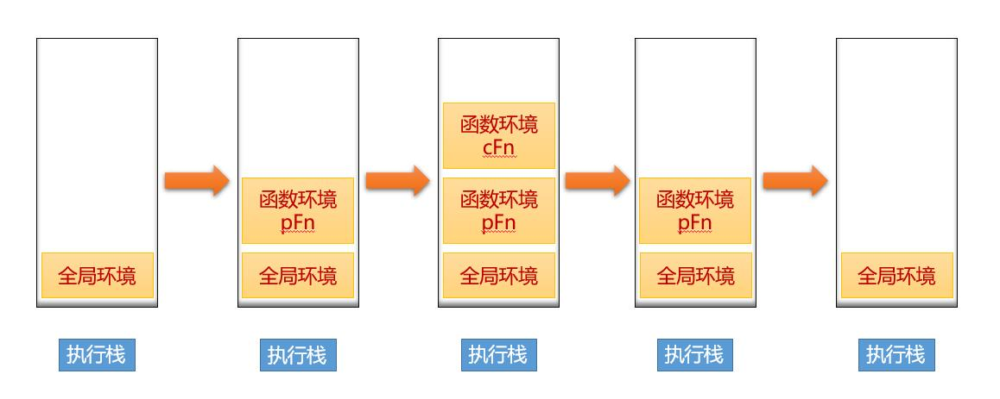

# 核心原理-如何理解执行上下文 / 执行环境


js 被解析和执行时所在环境 的抽象概念


| 概念 |别名| 描述 |
| ------ | -------------------------------- |-------------------------------- |-------------------------------- |
| Variable Environemnt 环境变量 VO |活动对象 | 函数执行时创建，进行 标识符绑定 ， arguments  , var , inner function define|
| Lexical Environment 词汇环境 |作用域 | 当前函数的作用域|
| 作用域链 | | 当前函数的作用域 与 被调用函数的作用域|
| 执行栈 | | 执行上下文的数据结构|
| ThisBinding | this| 确定this的指向，指向最终调用它的对象|


#### 一、理解执行上下文


+ 创建阶段
   + 标识符绑定 创建 `活动对象` 拥有属性，但不具备原型 ,首先初始化函数的参数arguments，提升函数声明和变量声明
      + 如果传入的参数是引用类型，那么函数内部 执行后依然会改变 引用类型的值
      
+ `作用域确定` 、 `作用域链`确定 (活动对象A，活动对象B与全局活动对象window)
+ 确定this指向 (指向最终执行对象)

+ 执行阶段
  + 形成一个新的作用域
    + 有形参，先给形参赋值
    + 预解释，函数声明优先变量声明高， 变量声明可以被覆盖
    + 私有作用域中的代码从上到下执行


#### 二、执行栈

 


#### 三、eval函数

> 调用eval函数时，JavaScript会 创建新的执行环境 , 包括： ThisBinding，LexicalEnvironment，VariableEnvironment 3种

+ Variable Environemnt 环境变量， 标识符绑定 ，然后指向 LexicalEnvironment

+ Lexical Environment 词汇环境

+ ThisBinding 当前绑定 (一般是全局对象)

#### 四、eval函数的作用与返回值

返回值

+ undefined
+ string 返回最后一个执行段的字符串

作用

+ 变量赋值
```js
eval("y = 2; i =2");
```
+ 对象定义
```js
eval("({b:2})");
```
+ 函数执行
```js
eval("innerFn()")
```
+ 间接调用
```js
var type = eval;// 模仿 ts 的 type 定义数据类型
type("var k = 1;");
console.log(k);// 1
```

执行原理层面

+ js新建一个执行环境时进行标识符绑定 , 绑定的标识符放到执行环境 VariableEnvironment 指向的 Lexical Environment中

+ eval函数的VariableEnvironment 与fn的VariableEnvironment  指向 同一个Lexical Environment

+ eval中声明的局部变量y被绑定到调用方 fn 的Lexical Environment中

+ eval执行完成，eval相关的执行环境被弹出栈顶

+ 但是因为 Lexical Environment 中还有绑定了的y，且 ThisBinding 是window 所以还可以访问


#### 五、eval函数的影响

+ 不可预知的变量提升
+ 定义变量会有驻留的情况
+ 不会创建一个新的作用域，并且它的作用域就是它所在的作用域
+ IE9之前，无论eval是直接调用还是间接调用，eval都当成直接调用处理，如果需要有间接调用的效果，可以使用IE提供的execScript函数


 
 
 