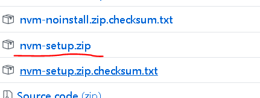

# 本地Node版本切换

> 作为1个老前端，当然是 React Vue Angular 一起开发啦 ， 那么就会面临一个问题 ， Node 版本是 不一致的 ！


#### solution - nvm

+ 1 安装 nvm , 建议选择 zip 包 ，免配置 ， 否则不能直接使用 nvm 指令

[下载 nvm-windows ](https://github.com/coreybutler/nvm-windows/releases "下载 nvm-windows")




+ 2 配置镜像

去到安装目录 `C:\Users\你当前的window账号\AppData\Roaming\nvm` ，  `settings.txt` 文件增加镜像配置

```bash
node_mirror: https://npm.taobao.org/mirrors/node/
npm_mirror: https://npm.taobao.org/mirrors/npm/
```

+ 3 常用指令与安装、切换

```bash
nvm list              // 列出当前所支持的全部node环境
nvm use 12.16.1       // Node环境切换到 v12.16.1
nvm install 9.11.2    // 安装 9.11.2 版本
nvm uninstall 9.11.1  // 卸载 9.11.1 版本
```

#### 附带其他信息


+ [Node历史版本 ](https://nodejs.org/zh-cn/download/releases/ "Node历史版本")