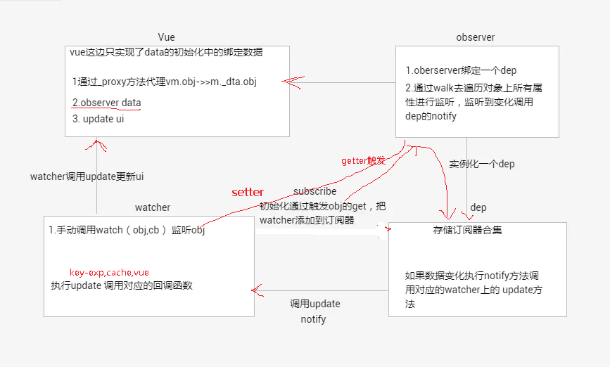

# 双向数据绑定原理

 
#### 核心 observer dep watcher

+ `observer：数据观察者`
   + observer中有对象属性 dep(订阅数组/订阅器)
   + 利用 defineReactive 对每个 key 进行 defineProperty 数据劫持, 并通过 getter/setter 把添加到 dep 订阅数组中
   + 当数据在 compile 绑定到视图时，会触发 将 key-watcher 添加到 订阅器中
   + 当 数据触发 setter 时，会调用对象属性 dep.notify() 对订阅数组中的 对应的 watcher 进行执行update

+ `dep` 关联 observer 与 watcher 的`订阅数组/订阅器`

+ `watcher` ：`数据订阅者`
   + 存在于 observer 的 dep 订阅数组中
   + 当 compile 解析是 调用 observer 的 getter 将 此 key-watcher 加入到订阅器中
   + exp 与 value 进行关联
      + 解析模板指令,如 exp = {{data}}，并替换模板数据 data
      + patch(newNode,oldNode)
   + 提供 vm._update(vm._render(), hydrating) 方法 
         + render() 返回 函数字符串执行，结构是: function(内部有对应的vnode json)

