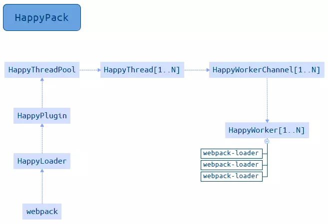

# 内存管理与多线程


#### 增加可用内存 , --max_old_space_size 设置

> 20480 = 20480/1024 = 20G

```json
{
    "scripts": {
        "dev": "webpack-dev-server --inline --progress --config build/webpack.local.conf.js",
        "build": "node --max_old_space_size=20480 build/build.js",
        "test": "node --max_old_space_size=20480 build/build-test.js",
        "prod": "node --max_old_space_size=20480 build/build-prod.js"
    },
}
```
 

 #### 使用多线程 - HappyPack 并行打包

`由于HappyPack 对file-loader、url-loader 支持的不友好，所以不建议对该loader使用`

 > JavaScript 是单线程模型，要想发挥多核 CPU 的能力，只能通过多进程去实现, 在 webpack 中 Loader 也是同步执行执行的

+ 安装

```bash
cnpm install -d --save happypack
```

+ plugin 设置

 ```js

 const HappyPack = require('happypack');

 
 plugins: [
    new HappyPack({
        // 使用 id 配置不同的公用loader
        id: 'happypack-babel',
        //如何处理  用法和loader 的配置一样
        loaders: [{
            loader: 'babel-loader?cacheDirectory=true',
        }],
        //共享进程池
        threadPool: happyThreadPool,
        //允许 HappyPack 输出日志
        verbose: true,
    })
]
 ```

 + loader 设置

 ```js
 module: {
    rules: [
        {
            test: /\.js$/,
            //把对.js 的文件处理交给id为 happypack 的实例执行
            loader: 'happypack/loader?id=happypack-babel',
            //排除node_modules 目录下的文件
            exclude: /node_modules/
        },
    ]
},
 ```


#### HappyPack 过程说明

 

 + 在 Loader 配置中，所有文件的处理都交给了 happypack/loader 去处理，使用紧跟其后的 querystring ?id=babel 去告诉 happypack/loader 去选择哪个 HappyPack 实例去处理文件

 + 在 Plugin 配置中，新增了两个 HappyPack 实例分别用于告诉 happypack/loader 去如何处理 .js 和 .css 文件。选项中的 id 属性的值和上面 querystring 中的 ?id=babel 相对应，选项中的 loaders 属性和 Loader 配置中一样。
 