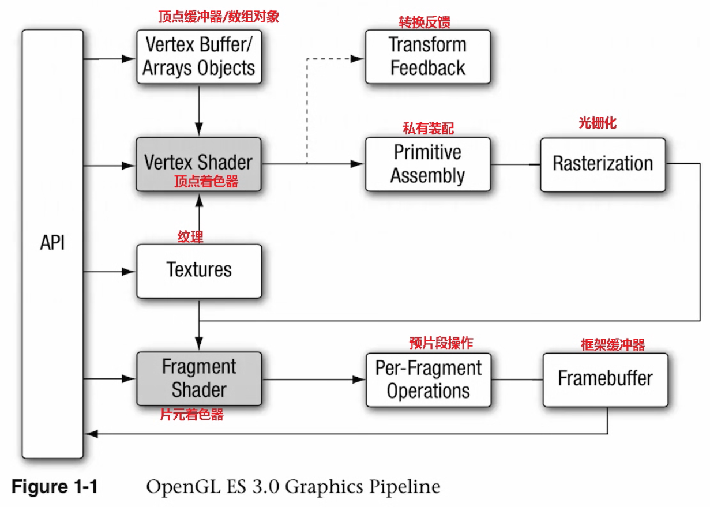

# WebGL概述

#### 一、OpenGL 渲染管线




## 二、顶点着色器 与 片元着色器

#### 顶点着色器

> 由 main 申明的一段程序源码或可执行文件

<h4>作用</h4>

+ 进行矩阵变换位置,
+ 计算光照公式生成逐顶点颜⾊,⽣成/变换纹理坐标.
+ 并且把位置和纹理坐标这样的参数发送到片段着色器

<h4>输入构成</h4>

| 名称| 作用|
| :------ | :-------------------------------- |
| 着色器程序 Shader Program| 由 main 申明的一段程序源码或可执行文件，<br/>描述在顶点上执行的操作，如坐标变换、计算光照公式产生每个顶点颜色、计算纹理坐标|
| 属性 Attribute| 空间位置，法向量，纹理坐标以及顶点颜色 |
| 统一值 Uniforms | 保存由应用程序传递给着色器的只读常量数据<br/>共享同一份 uniform 全局变量集<br/>保证这对同名变量|
| 采样器 Samplers| 特殊的 Uniforms  用于呈现纹理。sampler 可用于顶点着色器和片元着色器 |


<h4>输出构成</h4>

| 名称| 作用 |
| :------ | :-------------------------------- |
| 可变变量 Varying| 用于存储顶点着色器的输出数据，也存储片元着色器的输入数据<br/>会在光栅化处理阶段被线性插值<br/>顶点着色器如果声明了 varying 变量，它必须被传递到片元着色器中才能进一步传递到下一阶段，<br/>因此顶点着色器中声明的 varying 变量都应在片元着色器中重新声明为同名同类型的 varying 变量|
| gl_Position 内建变量|  |
| gl_FrontFacing  | 为back-face culling stage阶段生成的变量，无论精选是否被禁用，该变量都会生成|
| gl_PointSize  | 点大小|


<h4>示例代码</h4>

```js

// 位置属性
attribute vec4 position;
// 坐标属性
attribute vec2 textCoordinate; 

// 旋转角度
uniform mat4 rotateMatrix; 

// 输出变量
varying lowp vec2 varyTextCoord; 

// 着色器程序(Shader Program)
void main()
{
  // 赋值坐标属性到输出变量
  varyTextCoord = textCoordinate;
  // 位置乘以旋转矩阵
  vec4 vPos = position;
  vPos = vPos * rotateMatrix; 

  // 赋值位置到内建变量gl_Position上，作为输出信息（必须）
  gl_Position = vPos;
}
```

#### 片元着色器


