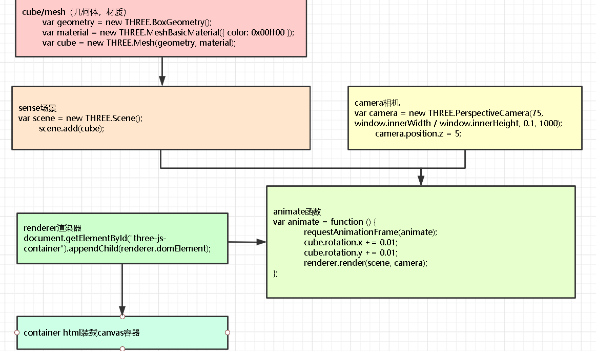

# webgl  与  Three.js

+ OpenGL大概许多人都有所耳闻，它是最常用的跨平台图形库

+ WebGL是基于OpenGL设计的面向web的图形标准，提供了一系列JavaScript API，通过这些API进行图形渲染将得以利用图形硬件从而获得较高性能

+ Three.js是通过对WebGL接口的封装与简化而形成的一个易用的图形库

#### Three.js 解决的问题

+ webgl接口的封装

+ 解析几何

+ 线性代数(逆转置矩阵)

#### Three.js 一般结构

